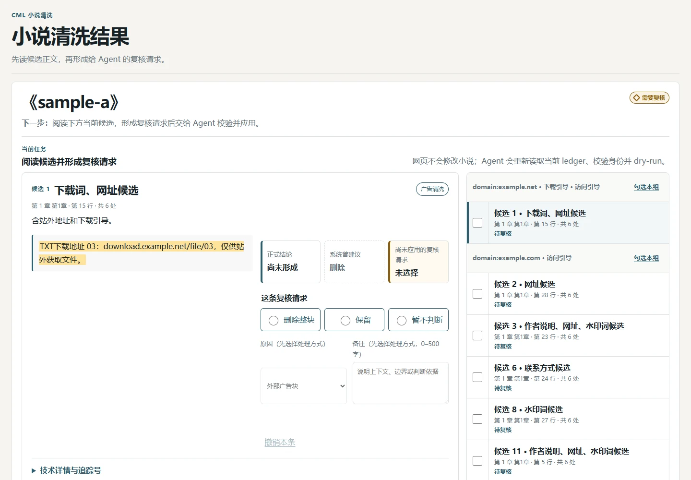
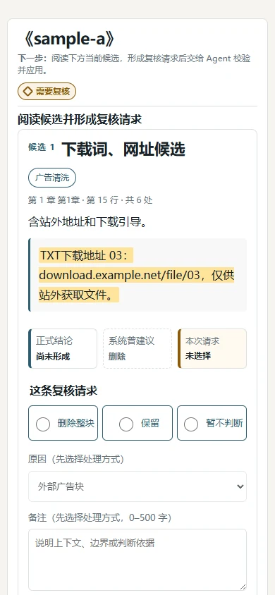

# CML Novel Purifier

[](https://github.com/yukino1338/cml-novel-purifier/actions/workflows/ci.yml)

[](LICENSE.txt)

**把本地中文 TXT 小说交给 AI，清掉夹在正文里的站外广告、水印和下载引导；拿不准的内容先停下来让你复核。**

你不用看候选编号，也不用手改 JSON。把小说放进清楚标好的输入文件夹，告诉 Agent 要清洗哪一本；结束后，它会主动告诉你状态、复核页和结果目录，只有验证通过才会附上清洗稿。原小说不会被覆盖，默认只生成 TXT。

下图由当前代码使用匿名合成测试文本生成，不含用户小说。



> [!TIP]
> **你看这份 README，Agent 看 [SKILL.md](SKILL.md)。** README 负责告诉人怎么开始、结果去哪里；`SKILL.md` 才是 Agent 必须遵守的完整执行契约。

## 30 秒看懂

| 你要做的 | Skill 会做的 | 你最后拿到的 |
| --- | --- | --- |
| 提供一部本地 `.txt` 小说 | 找出疑似广告，结合上下文逐条判断 | 验证通过后，默认一份 UTF-8 TXT 清洗稿 |
| 拿不准时看一眼复核网页 | 只执行通过安全检查的删除，失败就整体作废 | 可追溯的复核页和处理摘要 |
| 需要时说“加一份 Markdown/EPUB” | 完整验证后再导出指定格式 | 清楚、固定、可直接打开的结果目录 |

它的取舍很简单：**宁可少删，也不拿正文冒险。** 扫描规则只负责“找候选”，不能直接删字；只有 Agent 完整判断、脚本校验通过并完成最终复扫后，才会交付阅读文件。

## 不会写代码？照这三步做

你需要的是能读写本地文件、能运行终端命令的 Agent，例如 Codex、OpenCode、Claude Code 或同类工具。普通网页聊天窗口如果没有本地文件和终端权限，无法完成这套流程。

### 1. 把仓库链接发给 AI

第一次使用时，把下面整段发给 Agent：

```text
请帮我下载并准备 CML Novel Purifier：

1. 完整下载这个仓库，不要只复制 SKILL.md：
   https://github.com/yukino1338/cml-novel-purifier.git
2. 按当前 Agent 支持的方式把它启用为 Skill；如果不能安装，
   就进入仓库根目录，并在执行前完整阅读 SKILL.md。
3. 确认 Python 3.11–3.14 可用。
4. 找到包含 SKILL.md 的 Skill 根目录，并把它设为当前工作目录。
5. 在 Skill 仓库之外创建一个“小说清洗任务”目录，并运行：
   python scripts/init_job_root.py "<小说清洗任务的绝对路径>"

现在只准备工具，不要下载、读取或处理任何小说。
完成后，请把“待清洗_Input”文件夹的绝对路径告诉我。
```

<details>
<summary>想自己安装？展开查看命令</summary>

如果你的 Agent 支持 Vercel Labs 的 [skills CLI](https://github.com/vercel-labs/skills)，并且本机已有 Node.js，可以运行：

```bash
npx skills add yukino1338/cml-novel-purifier -g
```

不想安装到 Agent 时，直接克隆仓库并让 Agent 在仓库根目录工作也可以：

```bash
git clone https://github.com/yukino1338/cml-novel-purifier.git
cd cml-novel-purifier
python --version
```

运行小说清洗本身只需要 Python 3.11–3.14。开发、跑完整测试或复现 CI 时，才需要 `requirements-dev.txt`。

</details>

### 2. 把小说放进输入文件夹

初始化后，你会看到：

```text
小说清洗任务/
├─ 待清洗_Input/                       ← 把小说 TXT 放这里
├─ 小说清洗结果_Novel-Purifier/        ← 完成后只看这里
└─ .cml-novel-purifier/workspaces/     ← 内部工作区，不用手动操作
```

把小说复制到 `待清洗_Input/`。任务目录必须放在 Skill 仓库外；初始化命令只创建文件夹，不会读取、复制或删除小说。

### 3. 复制这段提示词

把路径换成你的真实文件：

```text
请先完整阅读 CML Novel Purifier 的 SKILL.md；如果它已经安装，
就使用 cml-novel-purifier Skill 清洗这本小说：

"<小说清洗任务>/待清洗_Input/书名.txt"

要求：
- 只清除外站广告、水印和下载引导，不改写剧情；
- 原文件不要修改；
- 保留原排版（默认 `preserve`，不主动改缩进、空行、标点），只输出 TXT，不要额外生成 Markdown 或 EPUB；
- 完整复核全部广告候选，不能只看第一页；
- 拿不准时安全停止，不要为了跑通而删除正文；
- 不要跳过最终验证；
- 无论完成、待复核还是被安全阻止，都要发布结果；
- 结束后主动告诉我：状态、开始页、复核页、清洗后文件、结果目录和下一步。
```

Agent 开始前应先告诉你：输入文件、原文不会修改、默认输出格式和预计结果目录。结束后也不应只说“完成了”，而要给出可以直接打开的绝对路径。

## 清洗后的小说在哪里

不用去 `.cleanwork` 或内部 JSON 目录里翻。每本书都有自己的结果入口：

```text
小说清洗任务/
└─ 小说清洗结果_Novel-Purifier/
   └─ <书名目录>/                     ← 同名书会自动区分
      ├─ 00_从这里开始_Start-Here.html   ← 优先打开这个
      └─ 某次处理时间/
         ├─ 01_查看结果_Review.html
         ├─ 02_清洗后_Cleaned.txt        ← 只有验证通过才会有
         └─ 03_处理摘要_Result.json
```

`00_从这里开始_Start-Here.html` 会同时指向“最新一次处理”和“最近一次成功结果”。正常情况下，Agent 会直接把它的绝对路径发给你，不需要你自己分辨书名目录。

| 状态 | 代表什么 | 有清洗稿吗 |
| --- | --- | --- |
| 处理完成（`completed`） | 全部流程和最终验证都已通过 | 有 |
| 需要复核（`needs_review`） | 还有候选或流程需要你确认 | 无 |
| 已安全停止（`blocked`） | 安全检查发现风险，已经停止 | 无 |
| 验证未完成（`incomplete`） | 最终验证没有完整跑完 | 无 |
| 仅检查（`report_only`） | 这次只做检查，没有修改正文 | 无 |

网页能打开，不等于已经清洗完成。**只有 `completed` 才会生成 `02_清洗后_Cleaned.txt`。**

## 需要复核时怎么做

1. 打开 Agent 发给你的 `01_查看结果_Review.html`。
2. 阅读正文和前后文，选择“删除”“保留”或“暂不判断”；需要时填写备注。
3. 点击“复制复核请求 JSON”，把复制内容发回同一个 Agent。
4. Agent 会重新读取当前候选和上下文，核对请求，生成完整复核记录，再依次编译、全量预检和验证；网页本身不会直接修改小说。

复核页支持单条判断、批量处理、进度导入导出和手机窄屏查看。内部候选号、锚点和坐标都收在技术详情里，不会挡住主要内容。

<details>
<summary>查看手机窄屏复核页</summary>



</details>

## 能做什么，不能做什么

| 能做 | 不做 |
| --- | --- |
| 清洗本地中文纯文本 `.txt` | 下载小说、抓取网站、绕过 DRM 或管理书库 |
| 查找外站广告、水印、下载引导和可疑重复块 | 改写剧情、润色、翻译、续写或猜测缺字 |
| 对正文与广告混在同一段的情况使用受校验的精确子段方案 | 为了删广告而整段删掉混合正文 |
| 报告异常章节标题和疑似屏蔽词 | 自动修改标题或还原屏蔽词 |
| 默认导出 TXT；按要求增加 Markdown 或基础 EPUB3 | PDF、DOCX、OCR、TTS 或复杂 EPUB 排版 |
| 生成离线复核页、处理摘要和精确回退记录 | 在线服务、账号系统、数据库或云同步 |

## 为什么它更保守

流程可以概括成一句话：

> 保留原文 → 找出候选 → Agent 结合上下文判断 → 整体应用 → 再扫一遍 → 交付结果

- **原文不动。** 第一份快照保留原始字节，清洗过程只写新版本。
- **规则没有删除权。** 命中关键词只会产生候选，正式结论必须覆盖完整候选集。
- **要改就一起改。** 只要有一个位置对不上，本次正文修改就整体作废，不会留下半本书已改、半本书未改的状态。
- **拿不准就停。** 混合正文、截断证据、旧复核结果或来源不一致都会触发安全停止。
- **验证不过就不交稿。** 最终版本会重放决策、检查章节和排版，并再次扫描强广告残留。
- **可以回退。** 全书、模块、章节和单个候选都有受校验的回退路径。


## 输入、排版与格式

- 输入只支持本地纯文本 `.txt`。自动模式严格识别 UTF-8、GB18030 和 Big5；编码冲突或混合编码拿不准时会停止，并提供受审计的修复路径。
- 默认输出一个 **UTF-8、无 BOM 的 TXT**。这表示“TXT 进、TXT 出”，不表示沿用原文件编码。
- 默认 `preserve`：不额外统一缩进、空行、标点或繁简体。只有你明确提出时，Agent 才能启用相应排版选项。
- 默认不会顺手生成所有格式。完成态始终交付 TXT；只有你明确要求时，才会额外增加 Markdown 或 EPUB。
- 原小说与不可变备份始终保留原始字节。详细规则见[文本输入契约](references/text-input-contract.md)。

## 常见问题

### 我不会写代码，真的能用吗？

可以。让有本地文件和终端权限的 Agent 负责下载、初始化和运行，你只需要放入 TXT、复制提示词、需要时打开复核页。

### 它会不会误删正文？

任何自动清洗都不能诚实承诺“绝不误判”。本项目通过完整复核、精确定位、整体提交、最终复扫和回退，把风险压低；遇到证据不足时宁可不删。重要小说仍建议保留自己的备份并查看复核页。

### 为什么没有生成 `02_清洗后_Cleaned.txt`？

先看状态。`needs_review`、`blocked`、`incomplete` 和 `report_only` 都不会伪造清洗稿。打开结果页查看唯一的下一步，处理完再让 Agent 继续。

### 默认会生成 TXT、Markdown 和 EPUB 三份吗？

不会。默认只有 TXT，避免浪费时间和存储。只有你明确要求时，才会额外增加 Markdown 或 EPUB。

### 小说乱码或同一文件混了多种编码怎么办？

不要让 Agent 猜编码或手工替换原文。Skill 会安全停止；确认主编码和异常物理行后，可使用受支持的 `input_repair.py inspect/apply-plan` 流程生成准备副本，原文件仍不变。

### Python 脚本会把小说上传到网络吗？

这些 Python 脚本不会联网，也不会调用模型 API；但宿主 Agent 必须读取广告候选及其前后文。若使用云端 Agent，这些文本片段会按该服务的方式处理。处理私密文本前，请确认其隐私政策与授权范围。

### 中途停止后能继续吗？原文件还能恢复吗？

工作区会保存已提交阶段和版本，Agent 可以从最早未完成处继续。原文件从未被覆盖；需要撤销已执行修改时，可按全书、模块、章节或单个候选回退。

## 给 Agent 和开发者

一般用户到这里已经够用。下面只保留集成、审计和贡献所需的入口；具体执行边界以 [SKILL.md](SKILL.md) 为准。

- 广告识别与判断：[广告模式](references/ad-patterns.md) · [判断指南](references/judgment-guide.md)
- 编码、换行与多语言保真：[文本输入契约](references/text-input-contract.md)
- 性能门槛与复现命令：[性能说明](references/performance.md)
- 独立 Agent 验证协议：[Forward Evidence Protocol](references/forward-evidence-protocol.md)

不要把 README 里的片段拼成一键脚本。主流程包含书籍画像、完整分页复核、正式编译、全量预检、最终验证和终态发布；缺少任何一步都应停止。Agent 必须按 `SKILL.md` 的当前顺序运行，并从每个脚本的实际回执取得工作区和下一阶段路径。

完成态始终包含 TXT。需要额外格式时，在 publisher 中同时传入 `--format txt` 与 `--format markdown` 或 `--format epub`；只有明确需要三种格式时才使用 `--all-formats`。

<details>
<summary>查看开发检查</summary>

```bash
python -m pip install -r requirements-dev.txt
python -m compileall -q scripts tests
python -m ruff check scripts tests
python -m coverage run --branch -m unittest discover -s tests -p "test*.py"
python -m coverage json -o coverage.json
python scripts/check_coverage.py coverage.json
python scripts/check_release.py
```

</details>

## 质量证据与当前边界

CI 覆盖 Python 3.11–3.14，并在 Ubuntu、Windows 和 macOS 上检查核心兼容性；开发门禁还包含单元测试、分支覆盖率、真实 CLI、事务故障、EPUB、浏览器交互、匿名路径和固定种子性能测试。

代码测试全绿，不等于 Agent 在所有小说上都判断准确。当前公开的 fresh-Agent 推理证据仍在按预注册协议收集，不能把历史回放包装成当前模型效果，也不会在样本不足时宣称通用准确率。进度与口径见 [Forward Evidence Protocol](references/forward-evidence-protocol.md)。

当前仍有这些明确边界：

- 标题异常和疑似屏蔽词只报告，不自动修改。
- 精确子段删除只能使用扫描器生成、编译器验证的计划；Agent 不能自由填写区间。
- 新站点、特殊排版或多语言噪声可能被保守留下，需要匿名回归样本后再扩规则。
- 复核页完全离线，不连接 CDN、在线字体或网络 API，也不会直接写回小说。
- 私有小说、工作区、实验沙盒、导出文件、coverage 和性能缓存都不属于公开仓库。

## 使用与版权

个人使用、分享完全免费；禁止任何形式的商业牟利，禁止包装成小程序/APP 收费。

本工具只清洗**用户本地自有文件**中的广告文本；不提供、不下载任何小说内容，内容版权归原作者所有。

本项目采用 [PolyForm Noncommercial License 1.0.0](LICENSE.txt)。本仓库不授予商业用途许可；分享本工具时，请同时提供 `LICENSE.txt`（或许可证网址），并保留其中的 `Required Notice`。正式权利与义务以许可证全文为准。
