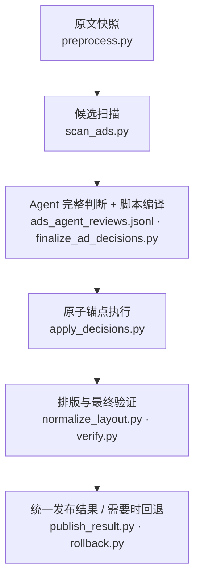

# CML Novel Purifier

CML Novel Purifier 是一个供 AI Agent 调用的中文 TXT 小说安全清洗 Skill。它把候选发现、Agent 判断、精确执行、最终验证、导出与回退拆成可审计阶段，优先保留正文，并让任何阻止项安全停下。

Python 脚本不连接模型，也不是“一键 AI 清洗器”。宿主 Agent 负责阅读全部当前候选并作出有证据的判断；脚本负责身份绑定、正式编译、事务执行和硬门禁。


*概念插图（非功能截图）：纸页、候选括号、版本副本和验证节点用于表达可审计且可回退的处理过程。*

## 它解决什么

- **误删正文：**扫描结果只是候选，不能直接修改文本；混合内容的整块删除、拟删除候选的截断锚点和不确定判断都会阻止执行。
- **部分执行与旧凭证：**任何锚点失败都会取消整次正文提交；apply、verify 和 export 都绑定当前扫描、决策、版本与运行来源。
- **Agent 难以稳定复现：**[SKILL.md](SKILL.md) 给出完整默认流程、判断边界、停止条件和按需 reference 路由，新上下文 Agent 不需要猜测隐藏步骤。

## 真实工作流



等价文字流程：保存不可变原文副本，扫描完整候选分页，由宿主 Agent 判断每个候选，编译并原子执行精确锚点，重放来源链和排版后验证；任何终态都由 publisher 主动交付复核页和摘要，只有当前最终版本验证通过才附带阅读文件，任何阶段都可按最小范围回退并使下游凭证失效。

## 能做与明确不做

| 能做 | 明确不做 |
| --- | --- |
| 严格读取本地纯文本 TXT，并保留原始字节快照 | PDF、DOCX、OCR、下载小说、抓站、管理书库或处理 DRM |
| 扫描外站广告、水印及可疑重复块 | 改写剧情、润色、翻译、续写或猜测缺字 |
| 由 Agent 完整复核广告候选后安全删除 | 把规则草稿直接当成可执行结论 |
| 报告异常标题与疑似屏蔽词 | 修改标题或还原屏蔽词；当前版本始终只报告 |
| 验证并导出 TXT、Markdown、基础 EPUB3 | PDF、DOCX、OCR、TTS 或富排版 EPUB 制作 |
| 生成离线单书/批量结果页和精确回退命令 | 在线服务、账号、数据库、云同步或模型 API |

## Agent 三步开始

1. 安装或启用本 Skill，并把本地 `.txt` 路径交给 Agent。
2. 请求：`使用 $cml-novel-purifier 安全清洗 <local-novel.txt>；保留原文，完整复核候选，遇到阻止项停止。`
3. Agent 会主动返回状态、复核页、清洗后文件（若有）和结果目录；不需要再追问网页在哪里。

用户不需要把候选编号复制回同一个 Agent，也不需要为脚本配置模型 token。候选判断是宿主 Agent 调用 Skill 后的正常职责。

## 5 分钟开始：从 GitHub 克隆到第一次清洗

这是一个 **Agent Skill**，不是把小说路径交给单个 `clean.py` 就能安全完成的
一键脚本。请完整保留仓库中的 `SKILL.md`、`scripts/`、`references/` 和 `assets/`；
不要只复制一个 Markdown 文件。

### 1. 准备本地副本与 Python

```bash
git clone https://github.com/yukino1338/cml-novel-purifier.git
cd cml-novel-purifier
python --version                 # 需要 Python 3.11–3.14
python -m pip install "PyYAML>=6,<7"
```

贡献、运行全套测试或浏览器回归时，再安装开发依赖：

```bash
python -m pip install -r requirements-dev.txt
```

### 2. 建立清晰的小说任务目录

在仓库目录外选择一个任务根。下面命令不会复制、扫描或删除小说，只会创建可发现的
输入、结果和隐藏工作区位置：

```bash
python -X utf8 scripts/init_job_root.py "<绝对任务目录>"
```

把 `.txt` 小说放入 `<绝对任务目录>/待清洗_Input/`。清洗后优先从
`<绝对任务目录>/小说清洗结果_Novel-Purifier/00_从这里开始_Start-Here.html`
打开结果；不要在仓库目录或小说原文目录里寻找临时 JSON。

### 3. 让宿主 Agent 执行，而不是手写决策文件

在一个新的 Agent 会话中打开克隆的仓库目录，并给出原文的绝对路径。若宿主没有自动
发现本地 Skill，就明确要求它先阅读仓库根目录的 `SKILL.md`。例如，已安装 OpenCode 的
用户可以在仓库根执行：

```bash
opencode run --model opencode-go/deepseek-v4-flash --dir . \
  "先阅读 SKILL.md；使用 CML Novel Purifier 安全清洗 <绝对小说路径>。保留原文，完整复核广告候选，遇到阻止项停止，并主动返回结果入口。"
```

Codex 用户同样应在新任务中使用已安装的 `$cml-novel-purifier`，或明确要求它读取此
仓库的 `SKILL.md` 后执行同一请求。不要让 Agent 手写 anchors、跳过 verify，或把
`blocked/incomplete` 说成清洗完成。

Python 脚本本身不向网络发送小说；但云端 Agent 可能会读取你提供给它的上下文。把私有
小说交给任何云端 Agent 前，应先确认你有相应授权，并只让它访问该任务的输入目录。

## 匿名 before / after

```diff
 第一章 示例
 正文段落甲。
-请访问 https://reader.example.com/update 获取站外更新。
 正文段落乙。
```

这个 diff 只是从零编写的结构示例。真实执行不会按关键词直接删行：只有完整候选集、Agent 复核、编译器复制的原始锚点和正式来源链全部一致时，删除才可能提交。

## 真实匿名结果页

下面是最终代码用匿名合成夹具生成的真实离线页面，不是 mockup。两张图展示同一可复现的“需要复核”状态：首屏直接给出当前候选正文、来源明确的正式/草稿/本次请求状态，以及三种可访问的判断方式；图中不含用户语料。

**桌面视图**


**约 390px 窄屏视图**


## 脚本硬保证与宿主 Agent 责任

| 脚本硬保证 | 宿主 Agent 责任 |
| --- | --- |
| `v0_original.txt` 和源文件身份绑定，后续版本另写 | 不编辑、替换或绕过 source/v0/manifest |
| 扫描分页、候选集和结构工件有哈希身份 | 读取扫描报告声明的全部当前分页 |
| 正式决策只能由当前 reviews + draft + candidates 重放得到 | 对每个候选写一条有证据的 `keep/delete/uncertain` |
| apply 全量预检、精确锚点、单事务提交 | 混合正文、上下文不足或风险不明时选择 `uncertain` |
| verify 重放正式编译、apply 与 layout，并完整扫强残留 | 不把 `blocked` 或 `incomplete` 描述为完成 |
| publisher 原子发布 review/result/latest，且只在 `passed` 时生成阅读文件 | 主动报告准确路径和每本任务状态，不用原始脚本 stdout 代替终态回执 |
| rollback 精确恢复并自动失效受影响状态 | 回退后从 manifest 最早 `pending` 阶段顺序重跑 |

标题和屏蔽词模块在当前版本严格只报告。即使用户请求修改也必须停止并说明：它们尚无受支持的 compiler/apply/verify 闭环，不能手改正文、手写可执行决策或借用 ads executor。

## 清晰目录、输出与回退

可先在 Skill 目录外初始化一个直观任务根：

```bash
python scripts/init_job_root.py "<job-root>"
```

它只创建 `待清洗_Input/`、用户唯一需要关注的
`小说清洗结果_Novel-Purifier/`，以及隐藏的 `.cml-novel-purifier/workspaces/`。
也可以直接传任意本地 TXT。新任务默认把 workspace 放在源文件父目录的隐藏内部根；已有且
身份匹配的旧 `<source>.cleanwork` 继续原地复用，不迁移、不删除。

任何终态都运行 `publish_result.py`。每本书的 `00_从这里开始_Start-Here.html` 同时指向
最新尝试和最近一次成功；每次尝试拥有独立目录。`completed` 默认只附带一个与已验证正文
逐字节一致的 UTF-8 TXT；`needs_review/blocked/incomplete/report_only` 只有复核页与结果摘要，
不会伪造阅读文件。按需使用可重复的 `--format txt|markdown|epub`；只有明确需要三种格式时
才使用 `--all-formats`。review、result、全部已请求格式和 latest 索引属于同一原子发布，
任一点失败都不会暴露半成品或覆盖旧成功入口。

用户说“增加 Markdown/EPUB”时，默认 TXT 仍保留，并额外请求相应格式；只有“只要 Markdown”或
“只转换为 EPUB”这类明确排他请求才输出单一格式。每份终态回执都会报告实际格式，以及 source/v0
的 `unchanged` 或 `mismatch` 结论；报告-only 与其他未完成终态的实际格式均为 `[]`。

被请求的阅读格式使用同一最终文本语义。EPUB 会检查容器、清单、spine、前置内容和章节正文，但定位仍是基础阅读文件，不是复杂电子书设计。

回退支持 `all`、`module`、真实章节 `chapter` 和唯一候选 `point` 四级范围。章节回退不接受 fallback chunk 伪装成章节；point 回退必须命中恰好一条正式修改决策。

## 高级 CLI

一般用户应让 Agent 按 [SKILL.md](SKILL.md) 运行。需要审计单个确定性阶段时，可展开下面的命令。

<details>
<summary>查看默认命令链</summary>

```bash
python scripts/preprocess.py "<novel.txt>"
python scripts/parse_structure.py "<novel.txt.cleanwork>"
python scripts/scan_ads.py "<novel.txt.cleanwork>"
python scripts/make_ad_decisions.py "<novel.txt.cleanwork>"
```

此时宿主 Agent 必须读取 `report/ads_scan_report.json` 声明的所有 `candidates/ads_pages/*.jsonl`，并写完整 `decisions/ads_agent_reviews.jsonl`。不要手写 anchors。

```bash
python scripts/finalize_ad_decisions.py "<novel.txt.cleanwork>"
python scripts/apply_decisions.py --workspace "<novel.txt.cleanwork>" --module ads --input versions/v1_preprocessed.txt --decisions decisions/ads_decisions.jsonl --output versions/v2_ads_removed.txt --stage 2_ads
python scripts/normalize_layout.py "<novel.txt.cleanwork>"
python scripts/verify.py "<novel.txt.cleanwork>"
python scripts/publish_result.py "<novel.txt.cleanwork>" --delivery-root "<absolute result root>"
# 仅在明确需要全部格式时：
python scripts/publish_result.py "<novel.txt.cleanwork>" --delivery-root "<absolute result root>" --all-formats
```

`finalize_ad_decisions.py` 有 `uncertain` 时必须停止。`verify.py --skip-residual-scan` 只生成 `incomplete` 状态，publisher 会安全发布复核页但不生成阅读文件。publisher 退出码固定为 `0=completed`、`2=可靠的非完成交付`、`1=publisher 自身失败且没有可靠新 bundle`。

```bash
python scripts/rollback.py "<novel.txt.cleanwork>" --level all
python scripts/rollback.py "<novel.txt.cleanwork>" --level module --module ads --overwrite
python scripts/rollback.py "<novel.txt.cleanwork>" --level chapter --module ads --chapter 12
python scripts/rollback.py "<novel.txt.cleanwork>" --level point --module ads --candidate-id AD-0042
```

</details>

配置只使用 [assets/config-templates/default.json](assets/config-templates/default.json) 声明的字段；唯一额外根键 `inherits` 可指向父配置，继承链会接受路径与循环检查。其他未知或拼错的键都会被拒绝。默认 `layout.enabled=false`，逐字符保留 apply 后的排版；只有用户明确要求统一排版时才启用 normalize 选项。标点转换和繁简转换默认关闭，OpenCC 只在显式配置时作为可选依赖。

`meta/book_profile.json` 同样只有一套严格 schema：`title`、`author`、`genre`、`narrative_style`、`summary` 为字符串，`main_characters`、`places`、`factions`、`terms`、`legitimate_structures`、`evidence` 为字符串数组，`rename_verified` 为布尔值。未知键、旧式 `rename_approved/rename/tags/labels`、嵌套对象和超限内容都会在草稿判断与导出前共同拒绝；只有 `rename_verified=true` 的画像标题可参与自动命名。

输入与文本保真边界以 [文本输入契约](references/text-input-contract.md) 为准：自动模式仅做严格 UTF-8、GB18030、Big5 判定；支持的显式编码、BOM 冲突、控制字符、换行计数、PUA/emoji 与混合语言保留规则都在该文档中冻结。预处理后的工作文本是 UTF-8 无 BOM，但 source 与 `v0_original.txt` 的原始字节身份永不改变。若预处理已因混合编码安全停止，可在用户确认主编码和完整广告物理行后使用 `input_repair.py inspect/apply-plan` 生成有审计账本的 `v0_prepared_input.txt`；它不会自动猜测、局部转码或修改 source/v0，且无法保证发现“在主编码下仍合法”的异编码字节。

## 安全停止条件

任一项出现时，Agent 应保留已有已提交工件并停止：

- 编码检测被阻止，或 source/v0/workspace 身份改变；
- 扫描分页缺失、重排、重复、哈希漂移，或拟删除候选的锚点截断；
- Agent review 缺失、重复、过期、字段非法或仍有 `uncertain`；
- 正式报告、reviews、draft、decisions 不能按当前候选重放；
- mutating `delete` 缺少完整 executable anchors，或锚点歧义、重叠、过期、策略不受支持；
- 删除比例超过 8%、章节身份改变、layout 重放失败或有强广告残留；
- 验证为 `blocked/incomplete`、attestation 过期、批量状态为 `partial/failed`；
- 路径边界、锁、事务恢复、原子发布或 manifest 血缘校验失败。

完整判断细则见 [references/ad-patterns.md](references/ad-patterns.md) 与 [references/judgment-guide.md](references/judgment-guide.md)。性能范围与可复现命令见 [references/performance.md](references/performance.md)。

## 支持环境与证据

- Python 3.11–3.14；主流程以标准库为主。
- CI 配置覆盖 Ubuntu 的 3.11–3.14，以及 Windows/macOS 的最低与当前版本组合。
- 开发门禁包含 compileall、Ruff、全量 `unittest`、分支覆盖率、真实 subprocess CLI、事务故障、EPUB、固定种子性质测试、浏览器和匿名路径检查。
- 关键安全模块有独立行/分支覆盖率下限；总体脚本行覆盖率下限为 90%。
- 40 MiB 匿名合成扫描基准使用绝对目标门禁；固定机器可额外执行 15% 相对回退门禁。

Forward evidence 分为两条不可混用的轨道：脚本与固定判断的回放只叫 **deterministic replay**，不能证明 Agent 推理质量；只有隔离的新上下文盲测才叫 **fresh-Agent inference**。当前公开 V1 已预注册 15 个分层槽、精确分母、Wilson 95% 区间和 runtime/guidance/schema 自动 stale 规则，但 `inference_results.json` 仍为 `pending`，因此目前没有可发布的当前 fresh-Agent 效果结论。历史 `forward_trials_summary.json` 不会因脚本在新版本上重放成功而自动变新。完整边界、任务面和执行顺序见 [Forward Evidence Protocol](references/forward-evidence-protocol.md)。

本地验证：

```bash
python -m compileall -q scripts tests
python -m ruff check scripts tests
python -m coverage run --branch -m unittest discover -s tests -p "test*.py"
python -m coverage json -o coverage.json
python scripts/check_coverage.py coverage.json
python scripts/check_release.py
```

仓库中的 CI 工作流只有在首次推送后实际全绿，才能作为对应托管环境已经通过的证据；本地成功不冒充远端 GitHub Actions 结果。

## 当前边界

- 扫描锚点描述完整候选块，仍禁止 Agent 自由选择块内区间。唯一受支持的子段修改是扫描器生成、编译器校验的 `exact_segment` 计划：复核只引用 `edit_plan_id` 和有界预览，不接触 offset；边界不合法时继续保留或待复核，绝不整行删除混合剧情。
- 广告规则以常见中文网文外部推广为目标；新站点或多语言噪声可能需要保守保留和新匿名夹具。
- 低置信结构的 fallback chunks 只用于定位，不是章节事实。
- 离线结果页不连接 CDN、在线字体或网络 API，也不直接修改正文或 JSONL。
- 私有小说、`.cleanwork`、实验沙盒、导出、coverage 和性能分析缓存都不属于公开发布树。

## 许可证

本项目采用 [PolyForm Noncommercial License 1.0.0](LICENSE.txt)。在遵守该许可证的
前提下，可用于非商业目的；本仓库不授予商业用途许可。商业授权联系渠道尚未在本仓库
公布，不能据此虚构任何个人、公司或联系方式。

## English summary

CML Novel Purifier is a conservative Agent Skill for cleaning external advertisements and watermarks from local Chinese TXT novels. It preserves an immutable source snapshot, requires complete host-Agent review, compiles exact anchors, applies all edits atomically, replays provenance and layout during final verification, and blocks export unless the current final head has a valid passed attestation. Title and masked-word findings are strictly report-only. Python 3.11–3.14 is the declared support range; see [SKILL.md](SKILL.md) for the executable Agent contract. This repository is offered under the [PolyForm Noncommercial License 1.0.0](LICENSE.txt); commercial use is not granted by this repository.
